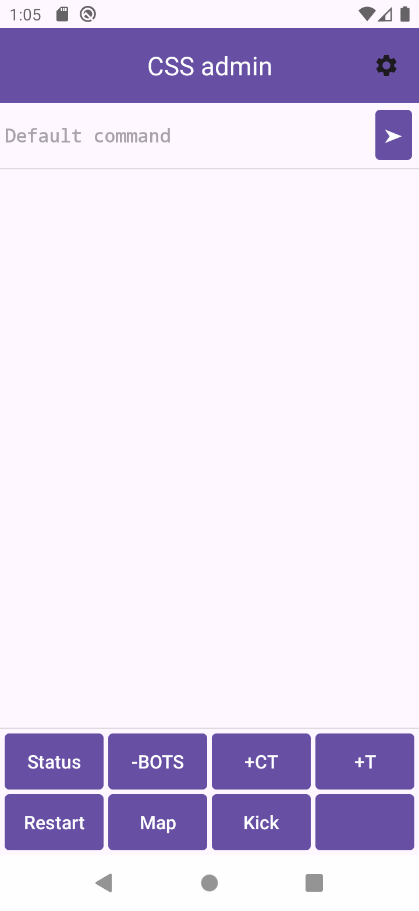
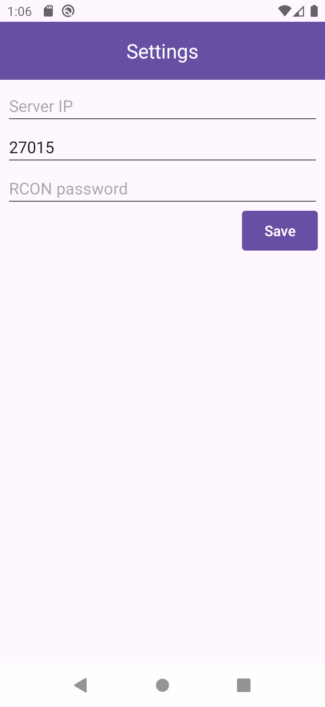
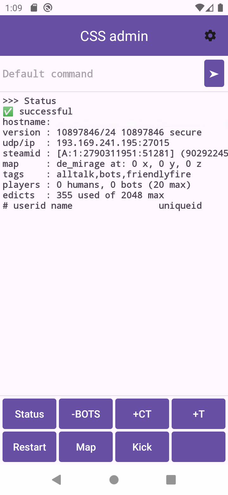
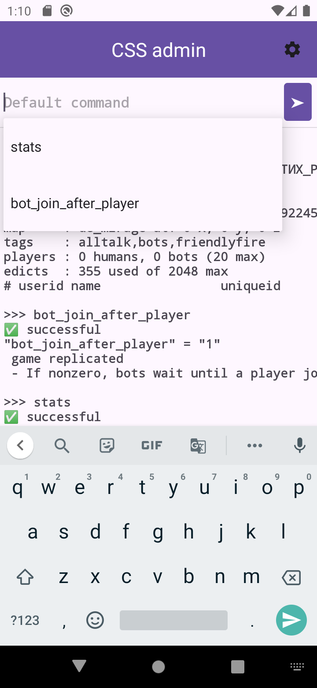
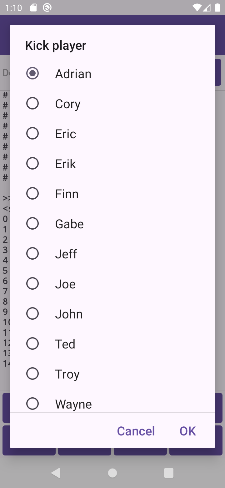
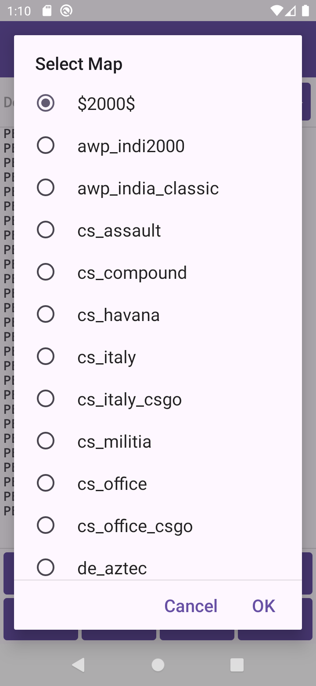

# CSS Admin

> Also available in: [Русский](README.ru.md) | [Українська](README.uk.md)

An Android application for administering **Counter-Strike: Source** servers via the **RCON** (Remote Console) protocol.

## About

CSS Admin lets you manage a CS:S game server directly from your phone, without launching the game client. It talks to the server using the same Source Engine RCON protocol used by the in-game console.

## Screenshots

  
  
  

  
  
  

## Features

- 📊 View server status and connected players
- 🤖 Add / kick bots (Terrorist or Counter-Terrorist)
- 🔁 Restart the current round
- 🗺️ Interactive map selection dialog (supports large map lists via multi-packet RCON)
- 👢 Interactive player management (kick players by ID from a sorted list)
- 💻 Send any custom RCON command and view the raw server response
- 🕒 Command history with autocomplete for quick re-entry
- ⚙️ Server address, port and RCON password are configured on-device (Settings screen)

## Requirements

- Android 10 (API 29) or higher
- A running CS:S server with RCON access enabled

## Setup

1. Install the app
2. Open **Settings** and enter your server's IP, port, and RCON password
3. Use the toolbar buttons or the command input field to control the server

## Disclaimer

This is an independent, unofficial tool. "Counter-Strike" is a trademark of Valve Corporation. This project is not affiliated with or endorsed by Valve.

## License

See [LICENSE](LICENSE) for details.
